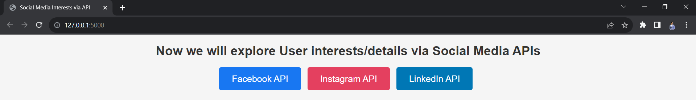

# socialinterests-socialapi

## Images

Project snippets/images are available in the photos folder in the root directory.

## Overview

The "socialinterests-socialapi" project is designed to help users explore and understand social media profiles and interests using Facebook, Instagram, and LinkedIn APIs. It leverages external libraries and services such as Facebook Graph API, Instagram Basic Display API, and ProxyCurl to gather user profile information and interests.



## Features

- Retrieve user profile information and interests from Facebook, Instagram, and LinkedIn.
- Explore and analyze user data, including profile details, posts, and more.
- Utilize external APIs and libraries to enhance data collection and analysis.

## Installation

To run this project, you'll need to install the required dependencies. You can use pip to install the necessary packages:

```bash
pip install facebook-sdk <!-- If you are using the Facebook SDK library -->
